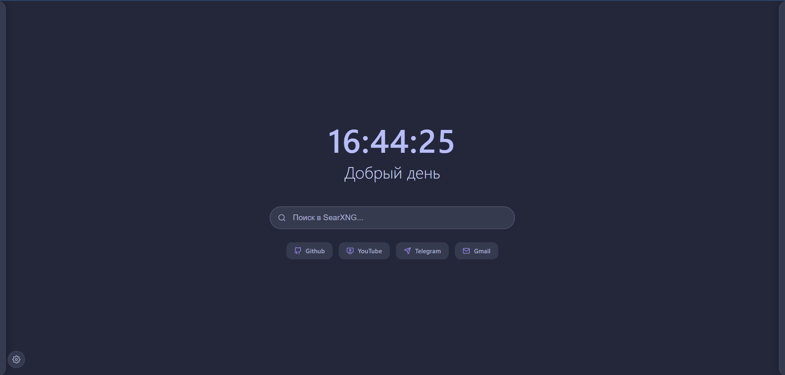
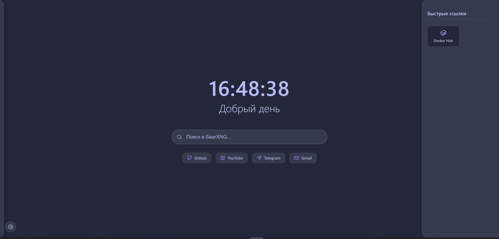
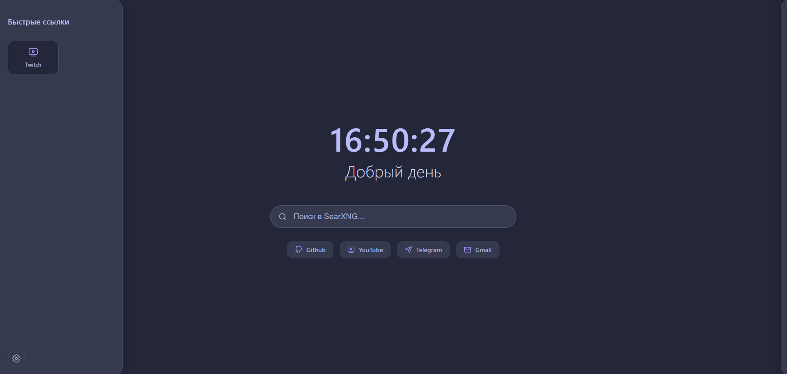
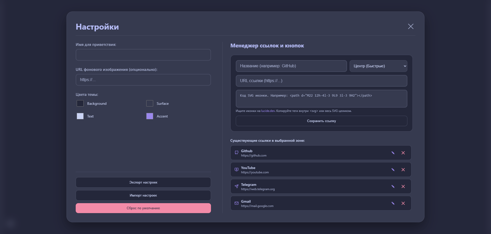

# 🔍 SearXNG Search & New Tab Customizable

### Является форком оригинального [SearXNG Search & New Tab](https://github.com/IriyaMitsuki/SearXNGaddon)

Элегантное расширение для Chrome, которое заменяет стандартную поисковую систему и страницу новой вкладки с кастомизацией на приватный поиск SearXNG.

## 📸 Скриншоты



## ✨ Особенности

- 🔒 **Приватный поиск** - Использует [search.hfox.app](https://search.hfox.app/) в качестве поисковой системы (один из инстансов SearXNG)
- 🎨 **Красивая новая вкладка** - Минималистичный дизайн с живыми часами и приветствием
- ⚡ **Быстрые ссылки** - Мгновенный доступ к популярным сервисам с возможностью кастомизации
- 🌙 **Темная тема** - Приятная для глаз цветовая схема Catppuccin
- 🚀 **Легкий и быстрый** - Минимальное потребление ресурсов

## 🎯 Что делает расширение

### Поиск по умолчанию
Заменяет стандартный поиск Chrome на SearXNG - метапоисковую систему, которая:
- Не отслеживает пользователей
- Не сохраняет поисковые запросы
- Агрегирует результаты из множества источников
- Не показывает персонализированную рекламу

### Новая вкладка
Красивая стартовая страница с:
- **Живыми часами** - всегда актуальное время
- **Умным приветствием** - меняется в зависимости от времени суток
- **Поисковой строкой** - прямой доступ к SearXNG
- **Быстрыми ссылками** - YouTube, GitHub, Telegram, Gmail

## 🚀 Установка


### Ручная установка
1. Скачайте или клонируйте этот репозиторий
2. Откройте Chrome и перейдите в `chrome://extensions/`
3. Включите "Режим разработчика" в правом верхнем углу
4. Нажмите "Загрузить распакованное расширение"
5. Выберите папку с файлами расширения
6. Готово! 🎉

## 🛠️ Технические детали

### Структура проекта
```
SearXNGaddon/
├── manifest.json      # Конфигурация расширения
├── index.html         # Страница новой вкладки
├── style.css          # Стили
├── script.js          # Логика часов и приветствий
├── icon.png           # Иконка расширения
├── LICENSE            # MIT Лицензия
└── README.md          # Документация
```

### SearXNG Instance
Расширение использует **[search.hfox.app](https://search.hfox.app/)** - один из инстансов SearXNG

## 🎨 Скриншоты

### Новая вкладка
Элегантный интерфейс с живыми часами и быстрыми ссылками

### Боковые панели



## 🔧 Настройка

### Изменение поискового инстанса
Если вы хотите использовать другой инстанс SearXNG:

1. Откройте `manifest.json`
2. Найдите секцию `chrome_settings_overrides`
3. Измените `search_url` на желаемый инстанс из [searx.space](https://searx.space/)

### Кастомизация быстрых ссылок и интерфейса
Кастомизация доступна прямо в интерфейсе через настройки. Сохранение производится в localStorage браузера, а так же имеется возможность экспортировать и импортировать ваши текущие настройки


## 📄 Лицензия

Этот проект распространяется под лицензией MIT. Подробности в файле [LICENSE](LICENSE).

## 🙏 Благодарности

- [SearXNG](https://github.com/searxng/searxng) - За отличную метапоисковую систему
- [searx.space](https://searx.space/) - За мониторинг инстансов SearXNG
- [Catppuccin](https://catppuccin.com/) - За прекрасную цветовую схему
- [Lucide](https://lucide.dev/) - За красивые иконки
- [IriyaMitsuki](https://github.com/IriyaMitsuki) - За оригинальный проект

---

<div align="center">
  <strong>Сделано с ❤️ для приватности в интернете</strong>
</div>
